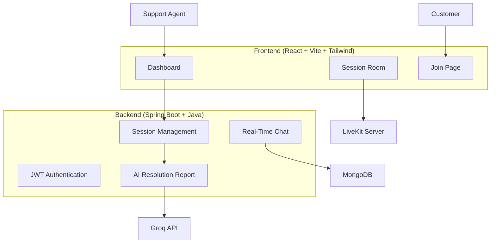

# FixLink

### *See the problem. Fix it faster.*

FixLink is a browser-based remote support platform designed to make customer support easier for hardware and appliance-related issues.

In many cases, customer support over phone calls becomes difficult because support agents cannot actually see the issue. Customers may struggle to explain problems clearly, which increases resolution time and frustration.

FixLink solves this problem by allowing support agents and customers to connect instantly through a browser-based video session. An agent can create a support session, share a secure invite link, and start troubleshooting visually in real time.

Along with video support, the platform also provides chat, session tracking, and an AI-generated resolution report after every session.

---

# Problem Statement

Traditional customer support systems mainly depend on voice calls. This works for simple problems but becomes inefficient when visual inspection is needed.

For example:

* A customer cannot explain a hardware issue properly
* A technician needs to verify installation setup
* A support agent wants to visually inspect a product issue

This often leads to:

* Longer support calls
* Poor issue understanding
* Delayed resolutions
* Frustrated customers

FixLink aims to reduce these problems through real-time visual support.

---

# Features

### 1. Real-Time Video Support

* Browser-based video calling using self-hosted LiveKit
* No software installation required
* Audio/video controls (mute, camera on/off)

### 2. Secure Session Creation

* Support agent creates a session
* Customer joins using a secure invite link
* No customer account required

### 3. Real-Time Chat

* Live messaging during support sessions
* Chat history stored for future reference

### 4. Session Timeline

Every activity during a support session is recorded automatically:

* customer joined
* messages sent
* mute/unmute actions
* session ended

### 5. Resolution Intelligence Report

After the session ends, AI generates a structured support report including:

* customer issue
* likely root cause
* troubleshooting steps
* resolution status
* severity level
* recommended next steps

### 6. Dashboard & Analytics

Support agents can view:

* active sessions
* completed sessions
* session history
* issue severity breakdown

### 7. Role-Based Access

Two user roles are supported:

**Agent**

* Create session
* End session
* Access dashboard

**Customer**

* Join session only

---

# System Architecture



---

# Tech Stack

### Frontend

* React 18
* Vite
* Tailwind CSS
* Zustand

### Backend

* Spring Boot 3
* Java 23
* Spring Security
* JWT Authentication
* STOMP WebSocket

### Database

* MongoDB

### Video Calling

* Self-hosted LiveKit

### AI

* Groq API (`llama3-70b-8192`)

---

# How to Run the Project

### Step 1: Start LiveKit
### Also it can be executed on the temrinal of vs code but as my system cant handle the load so i have used the powershell for running this cmds you can use the terminal of vs code as per your system config... 

```powershell
& "d:\AtomQFixLink\.tools\livekit\livekit-server.exe" --dev
```

### Step 2: Start Backend

```powershell
cd d:\AtomQFixLink\fixlink-server

& "d:\AtomQFixLink\.tools\maven\apache-maven-3.9.6\bin\mvn.cmd" spring-boot:run
```

### Step 3: Start Frontend

```powershell
cd d:\AtomQFixLink\fixlink-client
npm run dev
```

Open:

```text
http://localhost:5173
```

---

# Environment Variables

Create a `.env` file and add:

| Variable           | Description                           |
| ------------------ | ------------------------------------- |
| JWT_SECRET         | Secret key for JWT authentication     |
| LIVEKIT_API_KEY    | Use `devkey` for local mode           |
| LIVEKIT_API_SECRET | Use `secret` for local mode           |
| GROQ_API_KEY       | Optional (mock report works if empty) |

---

# Demo Flow

1. Agent logs in
2. Agent creates a support session
3. Invite link is generated
4. Customer joins using the link
5. Video call + chat starts
6. Agent ends session
7. AI generates Resolution Intelligence Report
8. Session details become available in dashboard

---

# Current Limitations

* One support agent per session
* File sharing not added yet
* Screen sharing not implemented
* AI report quality depends on available conversation/chat data

---

# Future Improvements

* Screen sharing support
* File upload during support
* Multi-agent support
* CRM integration
* Customer feedback system
* Better AI recommendations

Also one note that i have used the spring init for downloading as much as dependecies possible so that it could reduce my manual effort to do so...